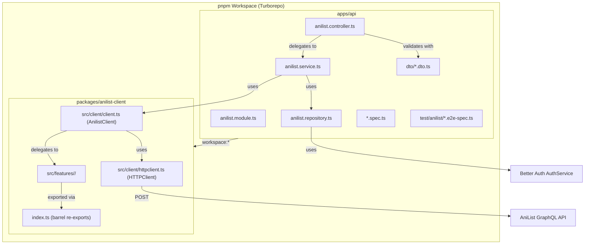

# Manverse — Adding an AniList Feature: Full Playbook

> **Audience**: An autonomous coding agent (or human developer) who needs to add a new query or mutation to `@manverse/anilist-client` and integrate it end-to-end through the NestJS API, with DTOs, tests, e2e tests, and Swagger docs.

---

## Table of Contents

1. [Architecture Overview](#1-architecture-overview)
2. [Package: `@manverse/anilist-client`](#2-package-manverseanilist-client)
   - [2.1 Feature Directory Anatomy](#21-feature-directory-anatomy)
   - [2.2 Step-by-Step: Add a New Feature](#22-step-by-step-add-a-new-feature)
   - [2.3 Mutation-Specific Guidance](#23-mutation-specific-guidance)
   - [2.4 Barrel Exports](#24-barrel-exports)
3. [App: `apps/api` — NestJS Integration](#3-app-appsapi--nestjs-integration)
   - [3.1 DTO Conventions](#31-dto-conventions)
   - [3.2 Controller Integration](#32-controller-integration)
   - [3.3 Module Registration](#33-module-registration)
   - [3.4 Swagger / OpenAPI Conventions](#34-swagger--openapi-conventions)
4. [Testing Strategy](#4-testing-strategy)
   - [4.1 Client Unit Tests (vitest)](#41-client-unit-tests-vitest)
   - [4.2 DTO Validation Tests](#42-dto-validation-tests)
   - [4.3 Controller Unit Tests](#43-controller-unit-tests)
   - [4.4 E2E Tests](#44-e2e-tests)
5. [Naming & Style Conventions](#5-naming--style-conventions)
6. [Error Handling Patterns](#6-error-handling-patterns)
7. [Checklist Summary](#7-checklist-summary)
8. [Reference: Existing Features Map](#8-reference-existing-features-map)

---

## 1. Architecture Overview



### Key Relationships

| Layer               | Location                           | Responsibility                                                            |
| ------------------- | ---------------------------------- | ------------------------------------------------------------------------- |
| **GraphQL Client**  | `packages/anilist-client`          | Pure, framework-agnostic AniList GraphQL operations with Zod validation   |
| **API Module**      | `apps/api/src/modules/anilist/`    | NestJS controller, service, repository, and DTOs for HTTP consumers       |
| **Feature Service** | `apps/api/src/modules/anilist/`    | AniList use cases and client orchestration                                |
| **Feature Repo**    | `apps/api/src/modules/anilist/`    | Better Auth access-token retrieval boundary                               |
| **Barrel**          | `packages/anilist-client/index.ts` | Single public entry point for all schemas, types, operations, and queries |

### Dependency Direction

```
Controller → AnilistService → AnilistClient → Feature operation fn → GraphQLExecutor.req()
AnilistService → AnilistRepository → Better Auth AuthService
```

The `AnilistClient` class is a thin façade. Each method delegates to a standalone `async function` living in a feature directory. The function accepts a `GraphQLExecutor` interface (implemented by `HTTPClient`) instead of the class — this is what makes features testable with a mocked executor.

---

## 2. Package: `@manverse/anilist-client`

### 2.1 Feature Directory Anatomy

Every feature lives under `src/features/<feature-name>/` with exactly **5 files**:

```
src/features/<feature-name>/
├── schemas.ts          # Zod schemas, inferred types, input schemas
├── queries.ts          # GraphQL query/mutation strings (gql tag)
├── operations.ts       # Async operation functions
├── operations.spec.ts  # Unit tests for operations
└── index.ts            # Barrel re-exports for the feature
```

> [!IMPORTANT]
> Every feature follows this exact 5-file structure. No file is optional. The shared `src/features/shared/` directory is for cross-feature utilities (e.g., `getViewerId`).

---

### 2.2 Step-by-Step: Add a New Feature

Below is the exact recipe, using a hypothetical **"save media list entry"** mutation as an example.

---

#### Step 1: `schemas.ts` — Define Zod Schemas

**Pattern observed across all 3 existing features:**

1. **Response schemas** — one schema per GraphQL response type, from leaf → root:

   ```typescript
   import { z } from 'zod';

   // Leaf schemas first
   export const saveMediaListEntryMediaSchema = z.object({
     id: z.number(),
     title: z.object({ userPreferred: z.string() }),
   });

   // Compose into parent
   export const saveMediaListEntrySchema = z.object({
     id: z.number(),
     mediaId: z.number(),
     status: z.string(),
     score: z.number().nullable(),
     progress: z.number().nullable(),
     media: saveMediaListEntryMediaSchema.nullable(),
   });

   // Top-level GraphQL `data` envelope
   export const saveMediaListEntryDataSchema = z.object({
     SaveMediaListEntry: saveMediaListEntrySchema.nullable(),
   });
   ```

2. **Input schema** — validate and transform caller input (with `.optional().default()` for defaults):

   ```typescript
   export const saveMediaListEntryInputSchema = z.object({
     mediaId: z.number().int().positive(),
     status: z.enum([
       'CURRENT',
       'PLANNING',
       'COMPLETED',
       'DROPPED',
       'PAUSED',
       'REPEATING',
     ]),
     score: z.number().min(0).max(10).optional(),
     progress: z.number().int().min(0).optional(),
   });
   ```

3. **Type exports** — always inferred from schemas, never hand-written:
   ```typescript
   export type SaveMediaListEntry = z.infer<typeof saveMediaListEntrySchema>;
   export type SaveMediaListEntryData = z.infer<
     typeof saveMediaListEntryDataSchema
   >;
   export type SaveMediaListEntryInput = z.input<
     typeof saveMediaListEntryInputSchema
   >;
   // Use z.output<> for the resolved/transformed type when defaults are applied:
   export type ResolvedSaveMediaListEntryInput = z.output<
     typeof saveMediaListEntryInputSchema
   >;
   ```

> [!NOTE]
> **`z.input<>` vs `z.output<>`**: Use `z.input<>` for the public-facing input type (what callers pass — optional fields allowed). Use `z.output<>` (or `z.infer<>`) for the resolved type after parsing (defaults populated, transforms applied). See `SearchMediaInput` vs `ResolvedSearchMediaInput` in the search feature for the established pattern.

---

#### Step 2: `queries.ts` — Write the GraphQL Query/Mutation

**Conventions:**

- Use `gql` from `@apollo/client` (template literal tag)
- Use `SCREAMING_SNAKE_CASE` for exported constants
- Name patterns: `<FEATURE>_QUERY`, `<FEATURE>_MUTATION`, `<FEATURE>_FIELDS_FRAGMENT`
- GraphQL operation name must be PascalCase and match the `operationName` used in `operations.ts`
- Fragments are defined as separate exports and interpolated into the query

```typescript
import { gql } from '@apollo/client';

export const SAVE_MEDIA_LIST_ENTRY_MUTATION = gql`
  mutation SaveMediaListEntry(
    $mediaId: Int!
    $status: MediaListStatus
    $score: Float
    $progress: Int
  ) {
    SaveMediaListEntry(
      mediaId: $mediaId
      status: $status
      score: $score
      progress: $progress
    ) {
      id
      mediaId
      status
      score(format: POINT_10_DECIMAL)
      progress
      media {
        id
        title {
          userPreferred
        }
      }
    }
  }
`;
```

---

#### Step 3: `operations.ts` — Implement the Operation Function

**Exact pattern (observed in all 3 features):**

1. Accept `executor: GraphQLExecutor` as the first parameter (never the `AnilistClient` class)
2. For authenticated operations: accept `accessToken: string` and call `requireAccessToken()`
3. Parse input with the input schema (fail-fast before any network call)
4. Call `executor.req<unknown>(...)` with query, operationName, variables, and optionally accessToken
5. Parse the raw response with the data schema
6. Return the inner payload (unwrap the GraphQL data envelope), returning `null` when the server returns null

```typescript
import { requireAccessToken } from '../../client/auth.js';
import type { GraphQLExecutor } from '../../types/httpclient.js';
import { SAVE_MEDIA_LIST_ENTRY_MUTATION } from './queries.js';
import {
  saveMediaListEntryDataSchema,
  saveMediaListEntryInputSchema,
} from './schemas.js';
import type { SaveMediaListEntry, SaveMediaListEntryInput } from './schemas.js';

export async function saveMediaListEntry(
  executor: GraphQLExecutor,
  accessToken: string,
  input: SaveMediaListEntryInput,
): Promise<SaveMediaListEntry | null> {
  const requiredAccessToken = requireAccessToken(
    accessToken,
    'The SaveMediaListEntry mutation',
  );
  const parsedInput = saveMediaListEntryInputSchema.parse(input);

  const rawData = await executor.req<unknown>({
    query: SAVE_MEDIA_LIST_ENTRY_MUTATION,
    operationName: 'SaveMediaListEntry',
    accessToken: requiredAccessToken,
    variables: {
      mediaId: parsedInput.mediaId,
      status: parsedInput.status,
      score: parsedInput.score,
      progress: parsedInput.progress,
    },
  });
  const data = saveMediaListEntryDataSchema.parse(rawData);

  return data.SaveMediaListEntry;
}
```

> [!IMPORTANT]
> **Authentication pattern**: Public endpoints (like `searchMedia`) do NOT take an `accessToken` parameter. Authenticated endpoints (like `getViewerProfile`, `getViewerMangaLists`) take `accessToken: string` and call `requireAccessToken()` which throws `AnilistClientAuthError` if the token is empty/whitespace. Mutations always require auth.

---

#### Step 4: `index.ts` — Feature Barrel Exports

Export everything consumers need — organized in 3 groups:

```typescript
// 1. Query/mutation constants
export { SAVE_MEDIA_LIST_ENTRY_MUTATION } from './queries.js';
// 2. Operation function
export { saveMediaListEntry } from './operations.js';
// 3. Schemas (runtime) — always from schemas.js
export {
  saveMediaListEntryDataSchema,
  saveMediaListEntryInputSchema,
  saveMediaListEntrySchema,
  saveMediaListEntryMediaSchema,
} from './schemas.js';
// 4. Types (type-only) — always from schemas.js
export type {
  SaveMediaListEntry,
  SaveMediaListEntryData,
  SaveMediaListEntryInput,
} from './schemas.js';
```

---

#### Step 5: Update the Package Barrel (`packages/anilist-client/index.ts`)

Add the new feature's exports to the root barrel. Maintain the existing grouping:

1. Runtime exports (schemas, operation functions, query constants)
2. Type-only exports

```typescript
// --- Existing exports stay unchanged ---

// Add runtime exports:
export {
  SAVE_MEDIA_LIST_ENTRY_MUTATION,
  saveMediaListEntry,
  saveMediaListEntryDataSchema,
  saveMediaListEntryInputSchema,
  saveMediaListEntrySchema,
  saveMediaListEntryMediaSchema,
} from './src/features/save-media-list-entry/index.js';

// Add type exports:
export type {
  SaveMediaListEntry,
  SaveMediaListEntryData,
  SaveMediaListEntryInput,
} from './src/features/save-media-list-entry/index.js';
```

---

#### Step 6: Add Method to `AnilistClient` Class

In [client.ts](file:///home/dankcode/projects/manverse/packages/anilist-client/src/client/client.ts):

```typescript
// Add import
import {
  saveMediaListEntry,
  type SaveMediaListEntryInput,
  type SaveMediaListEntry as SaveMediaListEntryResult,
} from '../features/save-media-list-entry/index.js';

// Add method to class
async saveMediaListEntry(
  accessToken: string,
  input: SaveMediaListEntryInput,
): Promise<SaveMediaListEntryResult | null> {
  return saveMediaListEntry(this.httpClient, accessToken, input);
}
```

**Pattern**: Each client method is a 1-line delegation to the feature's standalone function, passing `this.httpClient` as the executor.

---

### 2.3 Mutation-Specific Guidance

The existing codebase has only **queries** so far. Here's what changes for **mutations**:

| Aspect                    | Query                                                        | Mutation                                                                    |
| ------------------------- | ------------------------------------------------------------ | --------------------------------------------------------------------------- |
| GraphQL tag               | `query OperationName(...)`                                   | `mutation OperationName(...)`                                               |
| Exported constant name    | `*_QUERY`                                                    | `*_MUTATION`                                                                |
| Authentication            | May be public (`searchMedia`) or authed (`getViewerProfile`) | Always authenticated — always call `requireAccessToken()`                   |
| HTTP method on controller | `@Get()`                                                     | `@Post()` (use `@Body()` not `@Query()`)                                    |
| Swagger decorator         | `@ApiOkResponse()`                                           | `@ApiOkResponse()` or `@ApiCreatedResponse()` depending on semantics        |
| DTO                       | Query DTO with `z.coerce` for string→number                  | Body DTO does **not** need `z.coerce` (JSON body already has correct types) |

> [!CAUTION]
> Mutations modify state on AniList. The NestJS controller MUST use `@Post()` (or `@Put()` / `@Patch()` / `@Delete()` as appropriate) — never `@Get()`.

---

### 2.4 Barrel Exports

The [index.ts](file:///home/dankcode/projects/manverse/packages/anilist-client/index.ts) file is the **sole public API** of the package. It groups exports as:

1. `export { ... }` — runtime values (classes, functions, schemas, constants)
2. `export type { ... }` — type-only exports

All imports from `./src/features/<feature>/index.js` (never from internal files directly).

---

## 3. App: `apps/api` — NestJS Integration

### 3.1 DTO Conventions

DTOs live in `apps/api/src/modules/anilist/dto/` and follow two patterns:

#### Input / Query DTOs (request validation)

- File name: `<action>.dto.ts` (e.g., `search-media.dto.ts`, `get-user.dto.ts`)
- Use `createZodDto()` from `nestjs-zod`
- Schema name: `<action>DtoSchema` (camelCase)
- Use `z.coerce.number()` for query params (strings → numbers)
- Use `z.preprocess()` for booleans in query strings (`"true"` → `true`)
- Add `.describe()` on each field for Swagger docs
- Add `.meta({ id: '...', description: '...' })` on the schema for Swagger model naming
- Export the DTO class extending `createZodDto(schema)`

**Example** from [search-media.dto.ts](file:///home/dankcode/projects/manverse/apps/api/src/modules/anilist/dto/search-media.dto.ts):

```typescript
import { createZodDto } from 'nestjs-zod';
import z from 'zod';

export const searchMediaQueryDtoSchema = z
  .object({
    search: z.string().min(1).describe('AniList media search phrase'),
    page: z.coerce
      .number()
      .int()
      .positive()
      .optional()
      .default(1)
      .describe('Page number'),
    // ...
  })
  .meta({
    id: 'AniListSearchMediaQuery',
    description: 'AniList media search query parameters.',
  });

export class SearchMediaDto extends createZodDto(searchMediaQueryDtoSchema) {}
```

#### Response DTOs (Swagger documentation)

- File name: `<action>-response.dto.ts`
- Wrap the **anilist-client schema** with `.meta()` for Swagger naming
- Export the nullable response type for controller return signatures
- Export the DTO class for `@ApiExtraModels()` registration

**Example** from [search-media-response.dto.ts](file:///home/dankcode/projects/manverse/apps/api/src/modules/anilist/dto/search-media-response.dto.ts):

```typescript
import { searchMediaPageSchema } from '@manverse/anilist-client';
import { createZodDto } from 'nestjs-zod';
import { z } from 'zod';

export const anilistSearchMediaPageResponseDtoSchema =
  searchMediaPageSchema.meta({
    id: 'AniListSearchMediaPageResponse',
    description: 'An AniList media search page',
  });

export type AniListSearchMediaPageNullableResponse = z.infer<
  typeof anilistSearchMediaPageResponseDtoSchema
> | null;

export class AniListSearchMediaPageResponseDto extends createZodDto(
  anilistSearchMediaPageResponseDtoSchema,
) {}
```

#### Body DTOs (for mutations)

Same pattern as query DTOs but:

- **No `z.coerce`** — JSON request bodies already have correct types
- Use `@Body()` in controller instead of `@Query()`
- File name: `<action>.dto.ts` (e.g., `save-media-list-entry.dto.ts`)

---

### 3.2 Controller Integration

The [anilist.controller.ts](file:///home/dankcode/projects/manverse/apps/api/src/modules/anilist/anilist.controller.ts) stays thin:

- `@ApiSessionAuth()` on protected routes, `@AllowAnonymous()` plus throttling on public routes
- validated DTOs only
- no Better Auth access-token lookup
- no direct `AnilistClient` orchestration
- delegate every route to `AnilistService`

Protected endpoints pass `session.user.id` to the service. Public endpoints pass the validated DTO directly.

---

### 3.3 Module Registration

The [anilist.module.ts](file:///home/dankcode/projects/manverse/apps/api/src/modules/anilist/anilist.module.ts) is conventional:

```typescript
@Module({
  imports: [ThrottlerModule.forRoot([...])],
  controllers: [AnilistController],
  providers: [ThrottlerGuard, AnilistRepository, AnilistService, AnilistClient],
})
export class AnilistModule {}
```

`AnilistClient` is registered directly as a class provider. Controllers never inject it directly; they go through `AnilistService`.

---

### 3.4 Swagger / OpenAPI Conventions

1. **`@ApiExtraModels()`** on the controller class — register ALL response DTOs here
2. **`@ApiTags('Anilist')`** — all endpoints tagged under "Anilist"
3. **Response schemas** use `$ref: getSchemaPath(SCHEMA_NAME)` where `SCHEMA_NAME` matches the Zod schema's `.meta({ id: '...' })`
4. **Nullable responses** — use `anyOf: [{ $ref }, { type: 'null' }]`
5. **Error responses** — use `$ref` to pre-defined `HttpErrorResponse` or `ValidationErrorResponse` schemas
6. **`@ApiOperation()`** — always include `summary` and `description`
7. **`@ApiSessionAuth()`** — custom decorator that bundles cookie auth, 401 docs, and the security scheme

---

## 4. Testing Strategy

### 4.1 Client Unit Tests (vitest)

**Location**: `packages/anilist-client/src/features/<feature>/operations.spec.ts`

**Framework & tools**:

- `vitest` (test runner)
- `createMockGraphQLExecutor()` from `src/test-utils/graphql-executor.mock.ts`
- `ZodError` for validation rejection assertions
- `AnilistClientAuthError` for auth rejection assertions

**Test structure (copy this pattern exactly)**:

```typescript
import { beforeEach, describe, expect, it } from 'vitest';
import { ZodError } from 'zod';

import { AnilistClientAuthError } from '../../client/errors.js';
import {
  createMockGraphQLExecutor,
  type MockGraphQLExecutor,
} from '../../test-utils/graphql-executor.mock.js';
import { saveMediaListEntry } from './operations.js';
import { SAVE_MEDIA_LIST_ENTRY_MUTATION } from './queries.js';
import type { SaveMediaListEntry } from './schemas.js';

// Factory function returning a valid typed fixture
function createSaveMediaListEntryResult(): SaveMediaListEntry {
  return { /* full, valid object matching the schema */ };
}

describe('<feature> operations', () => {
  let executor: MockGraphQLExecutor;

  beforeEach(() => {
    executor = createMockGraphQLExecutor();
  });

  // ✅ Happy path — verified request shape and response
  it('should request and return the saved entry', async () => {
    const entry = createSaveMediaListEntryResult();
    executor.req.mockResolvedValue({ SaveMediaListEntry: entry });

    const result = await saveMediaListEntry(executor, 'token', { ... });

    expect(executor.req).toHaveBeenCalledTimes(1);
    expect(executor.req).toHaveBeenCalledWith({
      query: SAVE_MEDIA_LIST_ENTRY_MUTATION,
      operationName: 'SaveMediaListEntry',
      accessToken: 'token',
      variables: { ... },
    });
    expect(result).toEqual(entry);
  });

  // ✅ Null response
  it('should return null when AniList returns null', async () => {
    executor.req.mockResolvedValue({ SaveMediaListEntry: null });
    const result = await saveMediaListEntry(executor, 'token', { ... });
    expect(result).toBeNull();
  });

  // ✅ Auth rejection (for authenticated operations)
  it('should reject missing access token before calling the executor', async () => {
    await expect(saveMediaListEntry(executor, '', { ... }))
      .rejects.toBeInstanceOf(AnilistClientAuthError);
    expect(executor.req).not.toHaveBeenCalled();
  });

  // ✅ Input validation rejection
  it('should reject invalid input before calling the executor', async () => {
    await expect(saveMediaListEntry(executor, 'token', {} as never))
      .rejects.toBeInstanceOf(ZodError);
    expect(executor.req).not.toHaveBeenCalled();
  });

  // ✅ Response validation rejection
  it('should reject an invalid response payload', async () => {
    executor.req.mockResolvedValue({
      SaveMediaListEntry: { id: 'not-a-number' },
    });
    await expect(saveMediaListEntry(executor, 'token', { ... }))
      .rejects.toBeInstanceOf(ZodError);
  });
});
```

> [!IMPORTANT]
> **Mandatory test cases** for every feature operation:
>
> 1. Happy path with full request/response verification
> 2. Null response handling
> 3. Auth token rejection (if authenticated)
> 4. Invalid input rejection (executor not called)
> 5. Invalid response payload rejection
> 6. Default values applied (if input has `.optional().default()`)
>
> See existing tests for the precise assertions used: [search operations.spec.ts](file:///home/dankcode/projects/manverse/packages/anilist-client/src/features/search/operations.spec.ts), [profile operations.spec.ts](file:///home/dankcode/projects/manverse/packages/anilist-client/src/features/profile/operations.spec.ts), [media-list operations.spec.ts](file:///home/dankcode/projects/manverse/packages/anilist-client/src/features/media-list/operations.spec.ts)

**Running tests**:

```bash
# From packages/anilist-client/
pnpm test          # single run
pnpm test:watch    # watch mode
pnpm test:cov      # with coverage
```

---

### 4.2 DTO Validation Tests

**Location**: `apps/api/src/modules/anilist/dto/<action>.dto.spec.ts`

**Pattern**: Test the Zod schema directly (not the DTO class):

```typescript
import { describe, expect, it } from 'vitest';
import { saveMediaListEntryDtoSchema } from './save-media-list-entry.dto.js';

describe('saveMediaListEntryDtoSchema', () => {
  it('should parse valid input', () => {
    const result = saveMediaListEntryDtoSchema.parse({
      mediaId: 151807,
      status: 'CURRENT',
      score: 8.5,
      progress: 120,
    });
    expect(result).toEqual({ ... });
  });

  // For query DTOs: test z.coerce string→number conversion
  it('should coerce string values from query parameters', () => { ... });

  // Test defaults
  it('should apply defaults when optional values omitted', () => { ... });

  // Test validation failures
  it('should reject invalid values', () => {
    expect(() => saveMediaListEntryDtoSchema.parse({ ... })).toThrow();
  });
});
```

**Running**: `cd apps/api && pnpm test`

---

### 4.3 Controller Unit Tests

**Location**: [anilist.controller.spec.ts](file:///home/dankcode/projects/manverse/apps/api/src/modules/anilist/anilist.controller.spec.ts)

**Key patterns**:

1. **Setup**: Use NestJS `Test.createTestingModule()` with a mocked `AnilistService`.
2. **Test structure**: one `it()` per route, verifying the controller passes the right DTO/session id through and returns the service result.
3. **No access-token logic** belongs in controller tests anymore.
4. **Use `@faker-js/faker`** for dynamic test data when needed, seeded in `beforeEach`.

---

### 4.4 E2E Tests

**Location**: [anilist.e2e-spec.ts](file:///home/dankcode/projects/manverse/apps/api/test/anilist/anilist.e2e-spec.ts)

**Framework**: `supertest` + real NestJS app with mocked AniList client

**Key patterns**:

1. **App bootstrap**: Uses real `AppModule` with `overrideProvider(AnilistClient)`:

   ```typescript
   const moduleFixture = await Test.createTestingModule({
     imports: [AppModule],
   })
     .overrideProvider(AnilistClient)
     .useValue(mockAnilistClient)
     .compile();
   ```

2. **Auth helper**: `createAuthenticatedAniListUser()` creates a real DB user + session + AniList account link — returns `{ user, cookie, accessToken }`

3. **Cleanup**: Users created during tests are tracked in `createdUserIds[]` and deleted in `afterEach`

4. **Throttle storage**: Cleared in `beforeEach` to avoid rate-limit interference

5. **Test categories for each endpoint**:

   | Test               | HTTP                             | Status | Description                       |
   | ------------------ | -------------------------------- | ------ | --------------------------------- |
   | Happy path         | GET/POST                         | 200    | Verify body matches expected data |
   | Missing auth       | GET/POST (no cookie)             | 401    | Protected endpoints               |
   | No linked account  | GET/POST (cookie, no account)    | 404    | `NotFoundException`               |
   | No access token    | GET/POST (cookie, null token)    | 404    | `NotFoundException`               |
   | Validation failure | GET/POST (bad params)            | 400    | Zod validation error shape        |
   | Malformed response | GET/POST (mock returns bad data) | 500    | `ZodSerializerDto` catches it     |
   | Rate limit         | 60/30 rapid requests             | 429    | Throttler kicks in                |

   For **mutations**, add:
   - POST with valid JSON body → 200/201
   - POST with invalid JSON body → 400

6. **Helpers**:
   - `apiPath('/anilist/...')` → prefixes `/api/v1`
   - `authTest` → Better Auth test utilities (create user, login, get cookie)
   - `request(httpServer).get(...)` / `.post(...)` from supertest

**Running**:

```bash
cd apps/api
pnpm run pretest:e2e         # push schema to test DB
pnpm run test:e2e            # run e2e tests (uses .env.test)
```

---

## 5. Naming & Style Conventions

### File Naming

| Item              | Convention                    | Example                                 |
| ----------------- | ----------------------------- | --------------------------------------- |
| Feature directory | `kebab-case`                  | `media-list/`, `save-media-list-entry/` |
| Schema file       | `schemas.ts` (always)         | —                                       |
| Query file        | `queries.ts` (always)         | —                                       |
| Operations file   | `operations.ts` (always)      | —                                       |
| Tests file        | `operations.spec.ts` (always) | —                                       |
| Feature index     | `index.ts` (always)           | —                                       |
| API DTO file      | `<action>.dto.ts`             | `search-media.dto.ts`                   |
| API DTO spec      | `<action>.dto.spec.ts`        | `search-media.dto.spec.ts`              |
| API response DTO  | `<action>-response.dto.ts`    | `search-media-response.dto.ts`          |

### Variable/Type Naming

| Item                   | Convention                               | Example                                     |
| ---------------------- | ---------------------------------------- | ------------------------------------------- |
| Zod schema             | `camelCase` + `Schema` suffix            | `searchMediaInputSchema`                    |
| Inferred type          | `PascalCase` (no suffix)                 | `SearchMediaInput`                          |
| GraphQL constant       | `SCREAMING_SNAKE_CASE`                   | `SEARCH_MEDIA_QUERY`                        |
| GraphQL operation name | `PascalCase`                             | `SearchMedia`                               |
| Operation function     | `camelCase` verb phrase                  | `searchMedia`, `getViewerProfile`           |
| Client method          | Same as operation function               | `anilistClient.searchMedia()`               |
| DTO class              | `PascalCase` + `Dto` suffix              | `SearchMediaDto`                            |
| DTO schema             | `camelCase` + `DtoSchema` suffix         | `searchMediaQueryDtoSchema`                 |
| Response DTO schema    | `camelCase` + `ResponseDtoSchema`        | `anilistSearchMediaPageResponseDtoSchema`   |
| Swagger schema name    | `PascalCase` string (in `.meta({ id })`) | `'AniListSearchMediaPageResponse'`          |
| Controller constant    | `SCREAMING_SNAKE_CASE`                   | `ANILIST_SEARCH_MEDIA_PAGE_RESPONSE_SCHEMA` |

### Import Conventions

- Always use `.js` extension in imports (ESM)
- Use `type` keyword for type-only imports: `import type { ... } from '...'`
- Use `import { z } from 'zod'` (not default import) — though the codebase uses both `z from 'zod'` and `{ z } from 'zod'`, prefer `{ z }`

---

## 6. Error Handling Patterns

### In `@manverse/anilist-client`

| Error Type                   | When                             | Thrown By               |
| ---------------------------- | -------------------------------- | ----------------------- |
| `AnilistClientAuthError`     | Missing/empty access token       | `requireAccessToken()`  |
| `ZodError`                   | Invalid input (before request)   | `schema.parse(input)`   |
| `ZodError`                   | Invalid response (after request) | `schema.parse(rawData)` |
| `HTTPClientTransportError`   | Network failure                  | `HTTPClient.req()`      |
| `HTTPClientTimeoutError`     | Request timeout                  | `HTTPClient.req()`      |
| `HTTPClientAbortError`       | Request aborted                  | `HTTPClient.req()`      |
| `HTTPClientResponseError`    | Non-2xx status                   | `HTTPClient.req()`      |
| `HTTPClientGraphQLError`     | GraphQL errors in response       | `HTTPClient.req()`      |
| `HTTPClientInvalidJSONError` | Response not valid JSON          | `HTTPClient.req()`      |
| `HTTPClientMissingDataError` | No `data` field in response      | `HTTPClient.req()`      |

### In NestJS Controller

| Scenario                             | NestJS Exception             | HTTP Status |
| ------------------------------------ | ---------------------------- | ----------- |
| No linked AniList account            | `NotFoundException`          | 404         |
| No access token in account           | `NotFoundException`          | 404         |
| Zod validation (input DTO)           | Handled by `nestjs-zod` pipe | 400         |
| Zod validation (response serializer) | `Internal Server Error`      | 500         |

---

## 7. Checklist Summary

Use this checklist when adding any new AniList feature:

### `packages/anilist-client`

- [ ] Create `src/features/<feature>/schemas.ts` — response schemas, input schema, types
- [ ] Create `src/features/<feature>/queries.ts` — GraphQL query/mutation with `gql`
- [ ] Create `src/features/<feature>/operations.ts` — operation function(s)
- [ ] Create `src/features/<feature>/index.ts` — barrel re-exports
- [ ] Create `src/features/<feature>/operations.spec.ts` — unit tests (5+ mandatory cases)
- [ ] Update `src/client/client.ts` — add method to `AnilistClient` class
- [ ] Update `index.ts` — add runtime + type exports to package barrel

### `apps/api`

- [ ] Create `dto/<action>.dto.ts` — input DTO with Zod schema + `createZodDto`
- [ ] Create `dto/<action>.dto.spec.ts` — DTO validation tests
- [ ] Create `dto/<action>-response.dto.ts` — response DTO wrapping client schema with `.meta()`
- [ ] Update `anilist.controller.ts`:
  - [ ] Import new DTOs and response types
  - [ ] Register response DTO in `@ApiExtraModels()`
  - [ ] Add endpoint method with full Swagger decorators
- [ ] Update `anilist.service.ts` — keep controller thin and move orchestration here
- [ ] Update `anilist.repository.ts` — keep Better Auth access-token lookup here
- [ ] Update `anilist.controller.spec.ts` — mock `AnilistService` and add delegation tests
- [ ] Update `test/anilist/anilist.e2e-spec.ts`:
  - [ ] Add mock method to `mockAnilistClient`
  - [ ] Override `AnilistClient` directly
  - [ ] Add e2e test cases (happy path, auth, validation, rate limits)

### Verification

- [ ] `cd packages/anilist-client && pnpm test` — all pass
- [ ] `cd apps/api && pnpm test` — all pass
- [ ] `cd apps/api && pnpm run test:e2e` — all pass
- [ ] `cd packages/anilist-client && pnpm run check-types` — no type errors

---

## 8. Reference: Existing Features Map

### Feature: `profile` (Query — both public & authenticated)

| File                                                                                                                | Key Exports                                                                                       |
| ------------------------------------------------------------------------------------------------------------------- | ------------------------------------------------------------------------------------------------- |
| [schemas.ts](file:///home/dankcode/projects/manverse/packages/anilist-client/src/features/profile/schemas.ts)       | `profileUserSchema`, `userProfileInputSchema`, `viewerProfileDataSchema`, `userProfileDataSchema` |
| [queries.ts](file:///home/dankcode/projects/manverse/packages/anilist-client/src/features/profile/queries.ts)       | `USER_PROFILE_FIELDS_FRAGMENT`, `USER_PROFILE_QUERY`, `VIEWER_PROFILE_QUERY`                      |
| [operations.ts](file:///home/dankcode/projects/manverse/packages/anilist-client/src/features/profile/operations.ts) | `getViewerProfile(executor, accessToken)`, `getUserProfile(executor, input)`                      |

**Pattern**: Demonstrates both authenticated (viewer) and public (user by name/id) queries in a single feature.

---

### Feature: `search` (Query — public)

| File                                                                                                               | Key Exports                                                                       |
| ------------------------------------------------------------------------------------------------------------------ | --------------------------------------------------------------------------------- |
| [schemas.ts](file:///home/dankcode/projects/manverse/packages/anilist-client/src/features/search/schemas.ts)       | `searchMediaInputSchema` (with defaults), `searchMediaDataSchema`, 11 sub-schemas |
| [queries.ts](file:///home/dankcode/projects/manverse/packages/anilist-client/src/features/search/queries.ts)       | `MEDIA_SEARCH_FIELDS_FRAGMENT`, `SEARCH_MEDIA_QUERY`                              |
| [operations.ts](file:///home/dankcode/projects/manverse/packages/anilist-client/src/features/search/operations.ts) | `searchMedia(executor, input)` — no auth required                                 |

**Pattern**: Best example of a public query with pagination defaults and complex nested response schemas.

---

### Feature: `media-list` (Query — authenticated, uses shared viewer)

| File                                                                                                                   | Key Exports                                                                                       |
| ---------------------------------------------------------------------------------------------------------------------- | ------------------------------------------------------------------------------------------------- |
| [schemas.ts](file:///home/dankcode/projects/manverse/packages/anilist-client/src/features/media-list/schemas.ts)       | `viewerMangaListsInputSchema`, `viewerMangaListCollectionSchema`, re-exports from `shared/viewer` |
| [queries.ts](file:///home/dankcode/projects/manverse/packages/anilist-client/src/features/media-list/queries.ts)       | `VIEWER_MANGA_LISTS_QUERY`, re-exports `VIEWER_MANGA_LISTS_VIEWER_QUERY`                          |
| [operations.ts](file:///home/dankcode/projects/manverse/packages/anilist-client/src/features/media-list/operations.ts) | `getViewerMangaLists(executor, accessToken, input?)` — calls `getViewerId()` first                |

**Pattern**: Best example of an authenticated query that composes with a shared sub-operation (`getViewerId`). The operation makes **2 sequential GraphQL calls** — tests mock both with `.mockResolvedValueOnce()`.

---

### Shared: `viewer` (Internal utility)

| File                                                                                                                      | Key Exports                            |
| ------------------------------------------------------------------------------------------------------------------------- | -------------------------------------- |
| [schemas.ts](file:///home/dankcode/projects/manverse/packages/anilist-client/src/features/shared/viewer/schemas.ts)       | `viewerIdSchema`, `viewerIdDataSchema` |
| [queries.ts](file:///home/dankcode/projects/manverse/packages/anilist-client/src/features/shared/viewer/queries.ts)       | `VIEWER_ID_QUERY`                      |
| [operations.ts](file:///home/dankcode/projects/manverse/packages/anilist-client/src/features/shared/viewer/operations.ts) | `getViewerId(executor, accessToken)`   |

**Pattern**: Cross-feature utility. NOT exported from the package barrel — only consumed internally by `media-list`.

---

> [!TIP]
> **Best reference feature to copy**: Use the **search** feature as the template for public queries, and **media-list** for authenticated queries. Both demonstrate the complete pattern including complex nested schemas and thorough test coverage.
